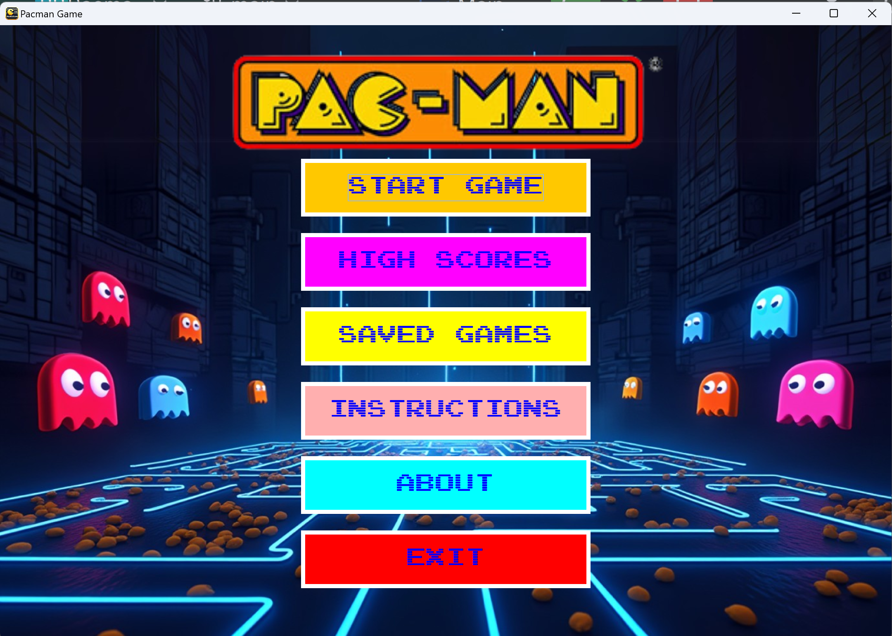

# Pacman Game

A classic Pacman game implementation in Java, featuring modern gameplay mechanics and additional features.

## Project Overview

This is a Java-based implementation of the classic Pacman arcade game, where players navigate through a maze, collect points, avoid ghosts, and try to achieve high scores.

## Project Structure

The project is organized into several main directories:

### Source Code (`src/`)
- `assets/` - Contains game resources and assets
- `entitys/` - Contains game entity implementations (Pacman, Ghosts, etc.)
- `main/` - Main game logic and controllers
- `objects/` - Game object implementations
- `tils/` - Utility classes and helper functions

### Data Files
- `high_score.txt` - Stores the highest score achieved
- `highscores.dat` - Stores detailed high score records
- `saved_games/` - Directory for saved game states

## Features

- Classic Pacman gameplay mechanics
- Score tracking and high score system
- Game state saving and loading
- Multiple levels
- Ghost AI behavior
- Power-ups and special items

## Technical Requirements

- Java Development Kit (JDK)
- Java IDE (IntelliJ IDEA recommended)

## How to Run

1. Open the project in your Java IDE
2. Ensure all dependencies are properly configured
3. Run the main game class to start playing

## Controls

- Use arrow keys to move Pacman
- Additional controls will be shown in-game

## Save System

The game includes a save system that allows players to:
- Save their current game state
- Load previously saved games
- Track and maintain high scores

## Development

This project is structured using object-oriented programming principles and includes:
- Entity management system
- Collision detection
- Score tracking
- Level management
- Asset management

## Project Files

The project includes several key components:
- Game entities (Pacman, Ghosts)
- Maze generation and management
- Score tracking system
- Asset management
- Game state management

---
## Contact & Feedback

For feedback and professional comments, please contact: [Email](mailto:israelbls12@gmail.com)
